# Wind Energy Production Forecasting

## Dataset(s)

### Training Data
This project uses data from the Data Engineering course, combining multiple sources:

| Dataset | Source | Features |
|---|---|---|
| **wind** | Open Meteo ECMWF, Geo.be, Kaggle (Uccle, Antwerpen) | Wind speed (km/h) per day |
| **productie** | Energie Vlaanderen, Elia | Wind & solar production (kWh) per hour |

The wind dataset contains daily wind speed measurements from multiple stations (Geo.be and Ukkel) covering 2000–2026. The production dataset contains hourly Elia wind energy production from February 2025 to March 2026.

**Preprocessing strategy:** Since wind data is daily and production data is hourly, production is aggregated to daily averages before merging. Cyclical features (sin/cos encoding) are added for month and day of year to capture seasonal patterns.

### New Data for Inference
The web service accepts live weather forecast data as JSON input. In production, this would come from the ECMWF API (Open-Meteo), which provides multi-day ahead hourly forecasts — allowing real predictions, not just backtests.

---

## Project Explanation

This project predicts the **average daily wind energy production (kWh)** for the Antwerp region using weather forecast data as input.

### Why is this useful?
The renewable energy transition creates grid instability: wind production is weather-dependent and inherently difficult to predict. Grid operators, energy traders, and prosumers all need reliable short-term forecasts to make balancing decisions. This system provides on-demand and scheduled forecasts to support those decisions.

### Inputs & Outputs

**Inputs:**
| Feature | Description |
|---|---|
| `geo_windspeed_10m` | Wind speed at 10m height (km/h) — Geo.be |
| `geo_windspeed_30m` | Wind speed at 30m height (km/h) — Geo.be |
| `ukkel_windspeed_10m` | Wind speed at 10m height (km/h) — Ukkel |
| `maand_sin` / `maand_cos` | Cyclical month encoding |
| `dag_sin` / `dag_cos` | Cyclical day-of-year encoding |
| `weekdag` | Day of the week |

**Output:**
| Field | Description |
|---|---|
| `predicted_kwh` | Predicted average wind energy production per day |
| `predicted_mwh` | Same value in MWh |

### Model Performance
| Model | RMSE |
|---|---|
| Linear Regression (baseline) | ~58,620 kWh |
| Random Forest (optimized) | ~37,914 kWh |

---

## Flows & Actions

### 1. Training Pipeline (`l1-train-and-deploy`)
Orchestrated with Prefect, tracked with MLflow:

1. **Preprocess** — merge wind + production data, add seasonal features
2. **Train** — Linear Regression baseline, logged to MLflow
3. **HPO** — Random Forest hyperparameter optimization with Optuna (5 trials)
4. **Register** — best model registered in MLflow model registry

```bash
docker compose --profile training run --rm train-deploy
```

### 2. Web Service (`l2-web-service`)
A Flask REST API that loads the registered model and returns predictions on demand.

```bash
docker compose up web-service
```

```bash
curl -X POST http://localhost:9696/predict \
  -H "Content-Type: application/json" \
  -d '{"datum": "2026-05-12", "geo_windspeed_10m": 4.5, "geo_windspeed_30m": 5.2}'
```

### 3. Batch Service (`l4-batch-service`)
A scheduled Prefect pipeline that runs automatically every day at 6:00 AM:
1. Fetches recent weather forecasts
2. Runs inference with the registered model
3. Compares predictions against Elia actuals
4. Generates an Evidently HTML performance report in `data/batch_results/`
5. Stores metrics in PostgreSQL for Grafana visualization
6. Triggers retraining if RMSE exceeds 150,000 kWh

The batch service starts automatically with the infrastructure:
```bash
docker compose up database experiment-tracking orchestration grafana batch-service
```

To trigger manually from the Prefect UI: go to `http://localhost:4200/deployments` and click **Run** on `wind-energy-batch-daily`.

### 4. Monitoring
- **Evidently** — HTML regression performance reports saved to `data/batch_results/`
- **Grafana** — real-time dashboard at `http://localhost:3400` showing RMSE over time
- **MLflow** — experiment tracking at `http://localhost:5000`
- **Prefect** — workflow UI at `http://localhost:4200`

---

## How to Run

### Prerequisites
- Docker & Docker Compose installed
- Data files in `data/` folder: `wind_final.csv`, `productie_combined.csv`

### Steps

```bash
# 1. Start infrastructure
docker compose up database experiment-tracking orchestration grafana

# 2. Train the model (wait until step 1 is fully started)
docker compose --profile training run --rm train-deploy

# 3. Start the web service
docker compose up web-service

# 4. Start batch service (runs automatically daily at 6:00)
docker compose up batch-service
```

### Makefile shortcuts

```bash
make help     # Toon alle beschikbare commando's
make build    # Bouw alle Docker images
make up       # Start de infrastructuur
make train    # Train het model
make serve    # Start de web service
make batch    # Start de batch service
make test     # Run unit tests
make lint     # Run pre-commit hooks
make all      # Start alle services tegelijk
make down     # Stop alle containers
```

### Running Tests

```bash
pip install pytest
pytest tests/ -v
```

---

## Dependencies

All dependencies are pinned per service:

| Service | Key dependencies |
|---|---|
| `l1-train-and-deploy` | mlflow==2.16.0, scikit-learn==1.7.1, prefect==3.4.0, optuna==3.6.1 |
| `l2-web-service` | flask==3.0.3, mlflow==2.16.0, scikit-learn==1.7.1 |
| `l4-batch-service` | mlflow==2.16.0, scikit-learn==1.4.2, evidently==0.4.30, prefect==3.4.0 |

---

## Screenshots

### MLflow — Experiment Tracking

#### Experiments overzicht
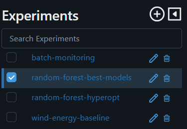

#### Baseline model (Linear Regression)
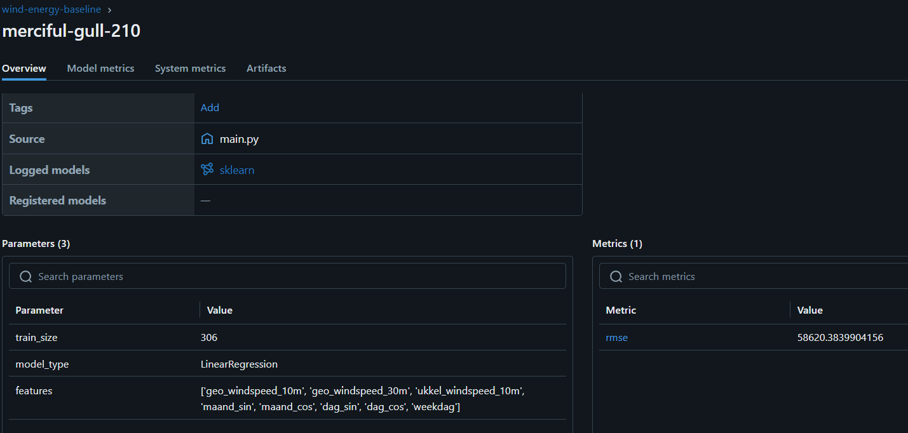

#### Hyperparameter optimalisatie — beste run
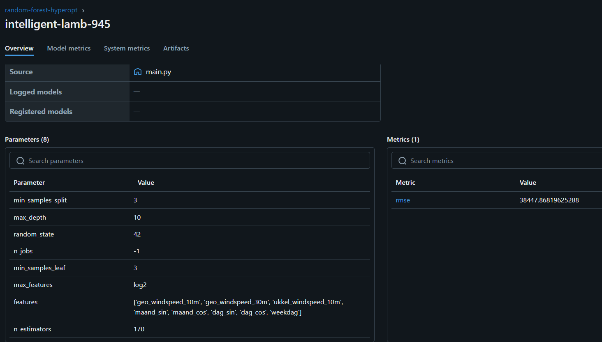

#### Beste model run
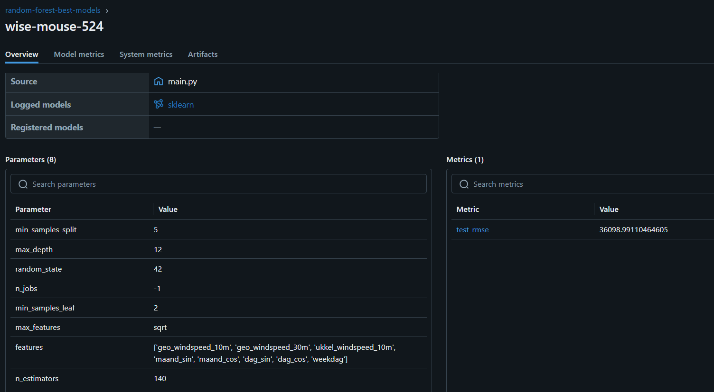

#### Batch monitoring
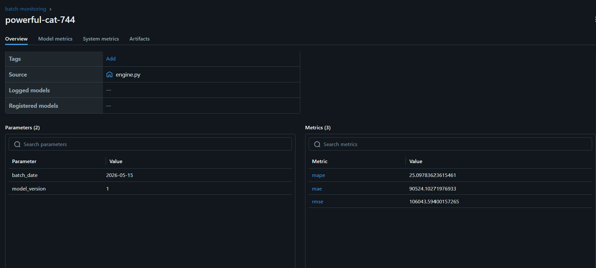

---

### Prefect — Workflow Orchestration

#### Flow runs overzicht
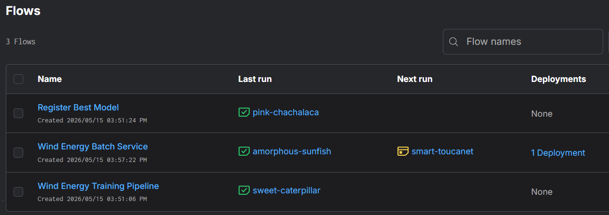

#### Training pipeline detail
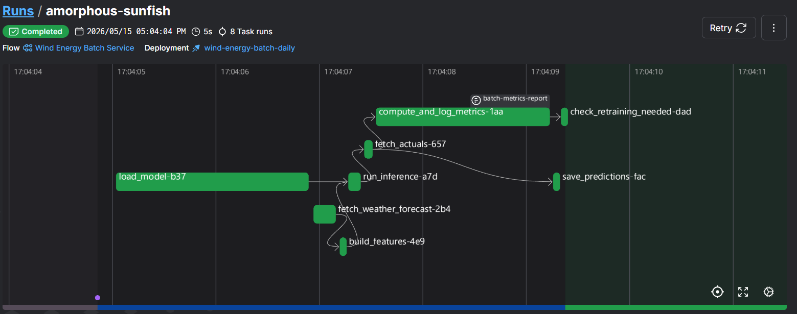

#### Batch service detail
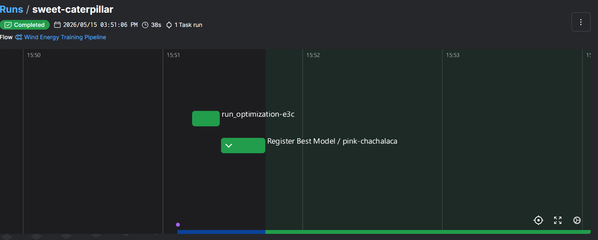

#### Batch monitoring artifact
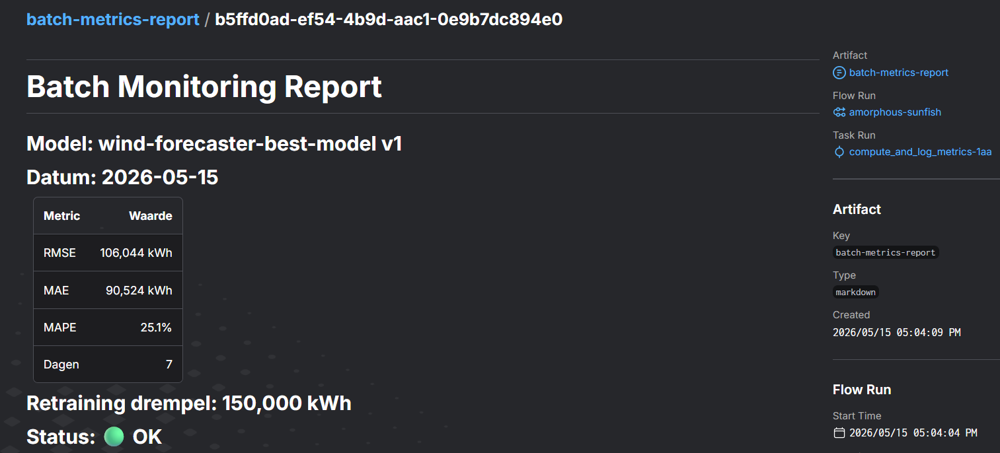

#### Deployments
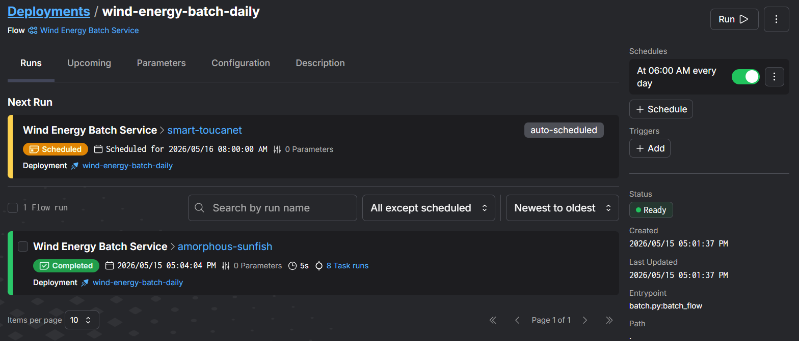

---

### Grafana — Model Monitoring

#### Dashboard overzicht
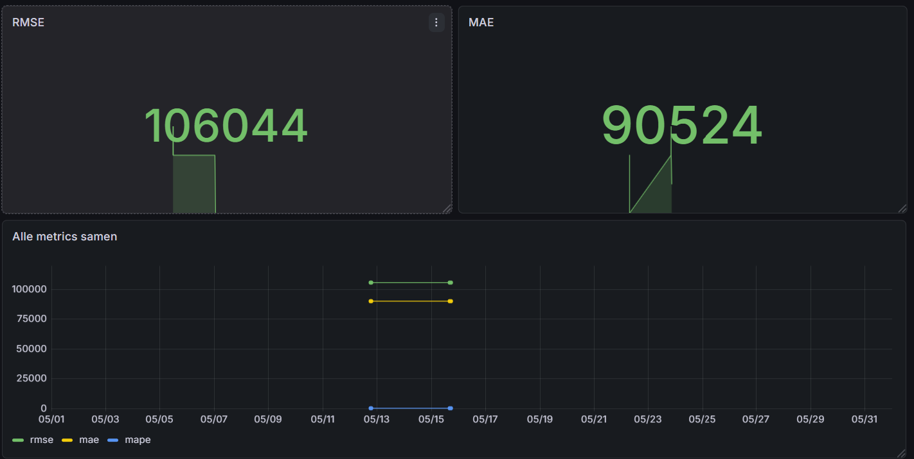

---

### Web Service — REST API

#### Voorspelling via curl
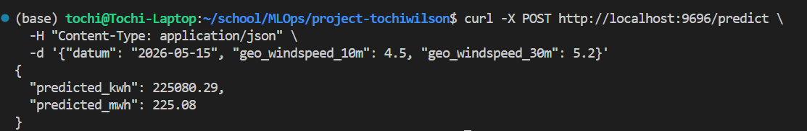
